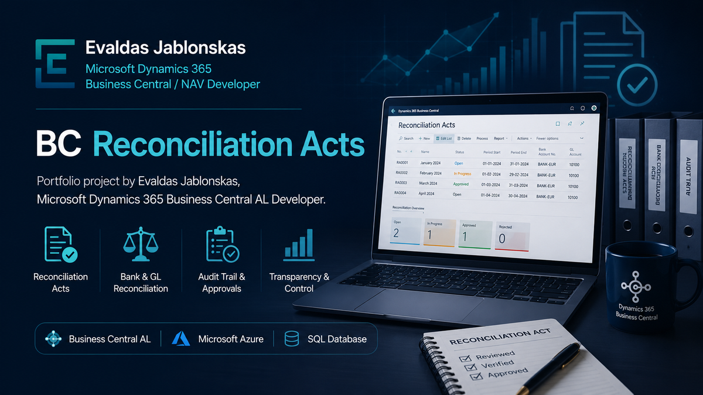

# BC Reconciliation Acts

Portfolio project by Evaldas Jablonskas, Microsoft Dynamics 365 Business Central AL / NAV Developer.

  

Microsoft Dynamics 365 Business Central extension for generating customer and vendor reconciliation statements.

## Features

* Customer reconciliation statements
* Vendor reconciliation statements
* Outstanding balance calculation
* Statement creation and issue workflow
* Email integration
* RDLC report layouts
* Word report layouts
* English and Lithuanian translations

## Technical Scope

* Tables
* Pages
* Reports
* Codeunits
* Table Extensions
* Page Extensions
* Enum Extensions
* Permission Sets

## Technologies

* Microsoft Dynamics 365 Business Central
* AL Language
* RDLC Reports
* Word Layouts

## Purpose

Demonstrates Microsoft Dynamics 365 Business Central AL development, reporting, and extension design.

## Additional Information

See [REPORT.md](REPORT.md) for technical project notes.
